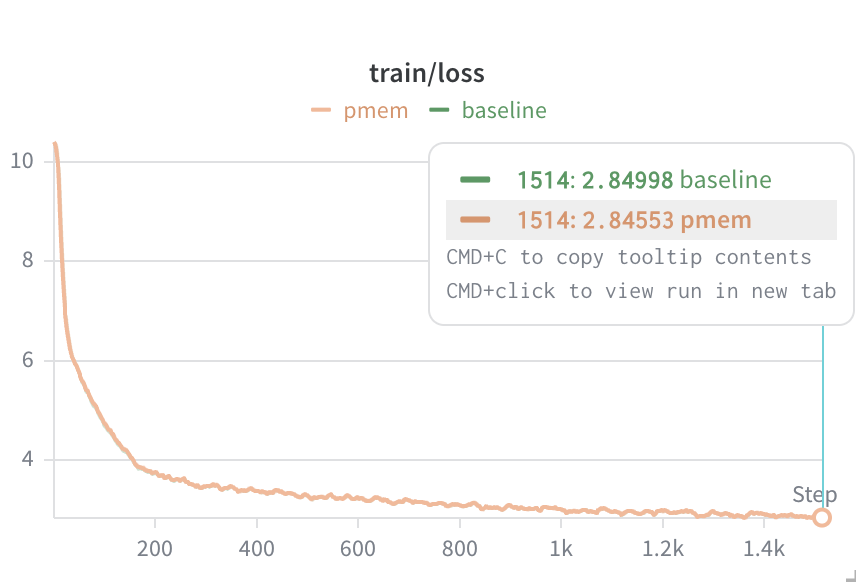
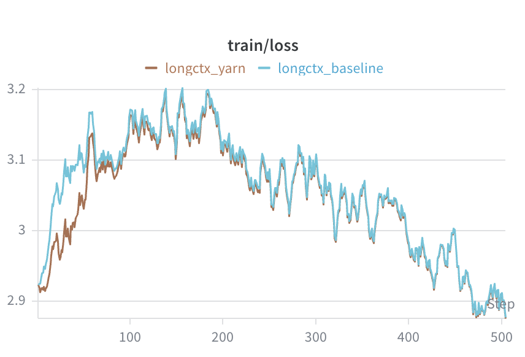
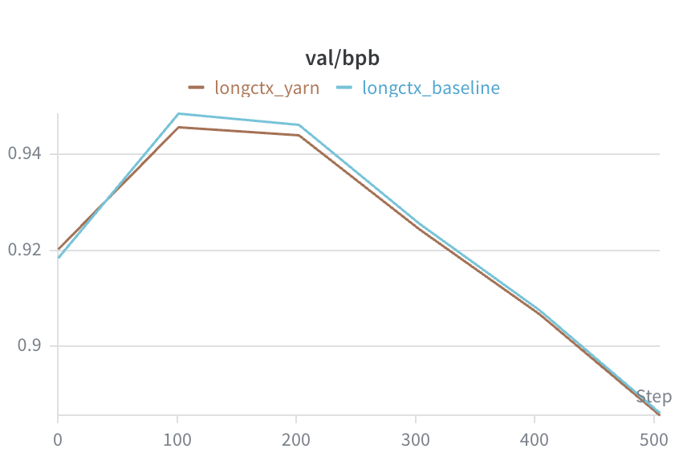

# Nanochat Modifications

本项目基于 nanochat GPT 做了两项改动：

1. **PMem-GQA：在 GQA attention 中引入 Persistent Memory**
2. **Bonus：长文本扩展（Long-Context Extension）**

其中，第一部分是当前的核心改动；第二部分是额外实现的 bonus 功能。

---

## PMem-GQA：在 GQA 中引入 Persistent Memory

### Motivation

当前实验主要基于 `SSSL` 这类长短窗口混合注意力结构。一个自然的判断是：

- `S` 层更偏向局部模式建模；
- `L` 层更偏向全局信息整合；
- 因而全局层可能更适合接入一组稳定的、可复用的 memory。

基于这个想法，本项目希望验证：

> 在 `SSSL` 架构中，为承担全局建模职责的层加入 persistent memory，是否能提升模型训练效果。

### Insight

#### GQA 的共享结构天然适合承载 memory

原版 GQA 中，多个 query heads 共享同一组 KV heads。  
这意味着如果希望引入额外的全局信息源，那么最自然的设计位置不是 query head，而是 **KV head**。

#### 全局层比局部层更需要 memory

在 `SSSL` 结构下，短窗口层主要负责局部依赖建模，而长窗口层更负责全局整合。  
因此，相比在所有层都引入 memory，将 memory 优先部署到长窗口层更符合结构分工。

### Architecture

#### 从标准 GQA 到 PMem-GQA

原版 attention 中：

- query head 数为 `n_head`
- key/value head 数为 `n_kv_head`
- 当 `n_head > n_kv_head` 时，通过 GQA 方式共享 KV head

也就是说，标准 GQA 的 KV 仍然只来自输入 token：

```text
k_ctx, v_ctx
```

当前版本中，在部分 attention 层里，为每个 **KV head** 额外引入 `n_pmem` 个 memory slots：

- `mem_k`
- `mem_v`

因此，attention 中真正参与计算的 KV 变为：

```
k_full = [mem_k ; k_ctx]
v_full = [mem_v ; v_ctx]
```

随后再按照 GQA 规则，把 KV 扩展到 query heads 上。也就是说，这版改动的核心是：

> **不是只让多个 query heads 共享 token 产生的 KV，而是让它们额外共享一组持久的 memory KV。**

#### Memory 的可见性设计

在注意力 mask 中：

- memory slots 对所有 query 位置始终可见；
- context token 仍保持标准 causal mask，只能看历史位置。

因此，PMem 的作用不是替代因果注意力，而是在因果上下文之外，提供一组额外的全局信息源。

#### 只在更适合的层启用 PMem

当前实验配置如下：

```
--window-pattern SSSL
--n-pmem=8
--n-pmem-layers=12
--pmem-long-only
```

它的含义是：

- 所有层都属于候选 PMem 层；
- 但只有 `L` 层真正启用 PMem；
- `S` 层仍保持原始 attention。

因此，当前版本本质上是：

> **局部层保持原状，全局层使用 PMem-GQA。**

#### 参数组织方式

PMem 层中新增两个参数：

- `mem_k`
- `mem_v`

其存储方式为二维矩阵：

```
(n_kv_head * n_pmem, head_dim)
```

forward 时再 reshape 成每个 KV head 对应的多组 memory slots。这样设计的好处是：

- 与 GQA 结构自然对齐；
- 参数量可控；
- 工程实现更直接，便于优化器分组与训练。

### Experiments

在 1500 steps 短训练中，可以观察到：

- **train loss 优于 baseline**
- **bpb 优于 baseline**




这初步支持了当前设计假设：

> 在 `SSSL` 结构中，将 persistent memory 与 GQA 结合，并优先部署到长窗口层，是有效的方向。

------

## Bonus：长文本扩展（Long-Context Extension）

本部分是额外实现的 bonus 功能，目标是让模型从 **1024 长度 checkpoint** 平滑继续预训练到 **2048 长度**，并支持更长的增量生成。

### Motivation

原始模型的长文本瓶颈主要有两个：

1. **位置外推问题**：训练时只见过较短位置，直接拉长上下文会导致 RoPE 在更远位置上退化。
2. **缓存上限问题**：rotary cache 是静态的，生成时累计位置一旦超过上限就会失效。

因此，长文本支持不能只改 `max_seq_len`，还必须同时解决：

- **位置编码扩展**
- **运行时 cache 扩展**

### Insight

#### 长文本扩展首先是位置建模问题

上下文变长，本质上是模型要处理“更远的位置”。
如果位置表示方式不变，模型即使能读入更长序列，也不一定能正确建模这些位置关系。

#### 继续预训练比从头训练更自然

已有短上下文 checkpoint 已经学到了语言建模能力。
更合理的做法是在此基础上做位置扩展，再继续预训练到更长上下文，而不是重新训练一套模型。

### Architecture

#### YaRN RoPE Scaling

本实现采用 [**YaRN**](https://arxiv.org/abs/2309.00071) 方式扩展 RoPE，而不是简单的线性位置缩放。

其核心思想是：**不同频率的 RoPE 维度承担的作用不同**，因此不应对所有维度做同样的缩放：

- **高频维度** 更偏向局部结构建模，应尽量保持不变；
- **低频维度** 更偏向长程依赖建模，应按长上下文需求进行缩放；
- **中间频段** 则采用平滑过渡，避免尺度突变。

这样做的作用是：在扩展上下文长度时，尽可能保留原模型在短距离建模上的能力，同时增强其对更长距离位置关系的适应性。

#### Dynamic RoPE Cache

新增动态 cache 扩容机制。
当当前所需位置超过已有 `cos/sin` cache 范围时，自动扩展 rotary cache，保证训练和生成都不会因为位置越界而中断。

#### 面向增量生成的位置检查

在带 KV cache 的生成过程中，真实需要覆盖的位置不是当前输入长度，而是历史位置 + 当前长度。

因此，位置范围检查与 cache 扩容都基于累计位置进行，保证长序列增量生成正确可用。

### Experiments

本项目采用 **1024 → 2048** 的继续预训练设定，在 1000 steps checkpoint 上继续训练 500 steps。实验结果如下：





当前结果表明，采用 YaRN 后，模型能够在保持原有训练稳定性的前提下，平滑迁移到更长上下文设置；同时，结合动态 RoPE cache，长序列增量生成也能够正确运行，不会因 rotary cache 长度不足而中断。

> 参考文献：Peng et al., YaRN: Efficient Context Window Extension of LLMs (2023).

